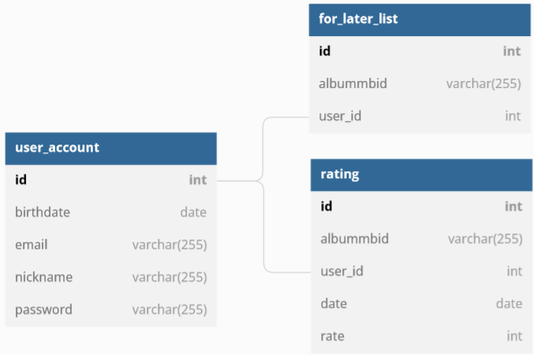
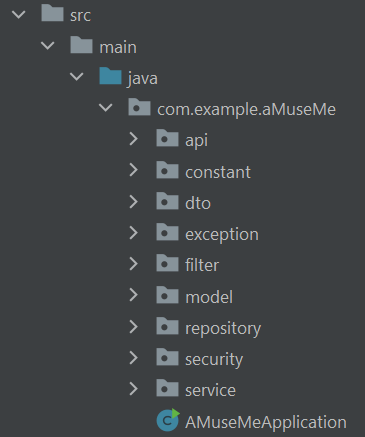
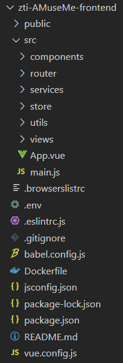

# AMuseME

Project for academic course Advanced Internet Technologies (pol. *Zaawansowane Technologie Internetowe*) 2022


---

## Table of contents
1. [Project description](#description)
1. [Functional assumptions](#assumptions)
1. [Database](#database)
1. [How to run a project?](#how2run)
1. [Server part](#server)
1. [Client part](#client)

---

## 1. Project description <a name="description"></a>

The main aim of this project was to create a server within Java Spring and Spring Data JPA (data access layer) as well as basic graphic user interface - SPA (single page application) written in Vue.js. 
The theme is a system allowing to searching information about various albums and artists, rating them, and adding them to special *for later* list.

---

## 2. Functional assumptions <a name="assumptions"></a>

A user is able to:
* search info about specific albums or artists (**even without an account**)
* create an account and log in/out
* manage their account (basic CRUD operations)
* rate music records (albums)
* add albums to special *for later* list

---

## 3. Database <a name="database"></a>

Relational database PostreSQL (ElephantSQL -- database as a service) was used in this project.
All tables' schemas are presented below.

| name     | type         | meaning   |
|:------:|:------:|:------:|
| `id`        | `INT` | user id  |
| `birthdate` | `DATE` | date of birth (used to calculate user's age) |
| `email`  | `VARCHAR(255)` | user's email address |
| `nickname` | `VARCHAR(255)` | user's preferred name |
| `password` | `VARCHAR(255)` | essential to log in (encoded in Java's backend) |
> `user_account` table schema

| name     | type         | meaning   |
|:------:|:------:|:------:|
| `id`        | `INT` | music record id |
| `albummbid` | `VARCHAR(255)` | album's MusicBrainz id (needed for API) |
| `user_id` | `INT` | user id  |
> `for_later_list` table schema

| name     | type         | meaning   |
|:------:|:------:|:------:|
| `id`        | `INT` | music record id |
| `albummbid` | `VARCHAR(255)` | album's MusicBrainz id (needed for API) |
| `user_id` | `INT` | user id  |
| `date` | `DATE` | date of rating |
| `rate` | `INT` | album's rate |
> `rating` table schema



---

## 4. How to run a project? <a name="how2run"></a>

***In order to run the project you are required to have Docker installed.***


1. Open terminal and clone this repo to your local directory
    ```
    git clone https://github.com/bartosz-rogowski/zti-AMuseMe.git
    ```

1. Enter the directory:
    ```
    cd zti-AMuseMe
    ```

1. Create docker containers (*if you do it n-th time - after building the images - you can skip `--build` flag*)
    ``` 
    docker-compose up --build
    ```

1. Enter http://localhost:3000/ in preferred browser

1. In order to stop app, click `Ctrl`+`C` in terminal window and then execute
    ```
    docker-compose down
    ```

---

## 5. Server part <a name="server"></a>
Server was implemented in Java Spring Boot and Spring Data (data access layer).
The structure of project is presented below and it separates logically every component. 



Every directory contains:
* `api` – classes handling requests from the client
* `constant` – class with all constant values used in the application
* `dto` – Data Transfer Object classes
* `exception` – classes handling exceptions as well as implementation of the custom exception
* `filter` – Java Spring Security filters responsible for authentification and authorization 
* `model` – classes mapping entities from relational database
* `repository` – interfaces of data access methods 
* `security` – class configuring application's security (including endpoints protection)
* `service` – classes handling and making actions on data (middle *layer* between api controllers and database entities models).

Authentification and authorization are handled with the JWT token logic.

---

## 6. Client part <a name="client"></a>

Single page application was written in Vue.js with [Bulma](https://bulma.io/)'s help (for styling). 
All data about music records and artists is provided within [MusicBrainz API](https://musicbrainz.org/doc/MusicBrainz_API). The only field needed for getting details about specific release is its identificator - MBID. Thereby other information are not necessary to be stored in the database.
In order to enhance visual representation, the [Cover Art Archive API](https://coverartarchive.org/) is used to retrieve albums' covers. It is compatible with MusicBrainz so that a cover can be fetched with use of MBID.
Moreover, artists' images are fetched from Wikipedia (artist's name page) so it is possible that it will *not* properly present a given artist.

The structure of this part is presented below.



User actions and further examples are described in details [in the project's documentation](./doc/doc.pdf) starting from page 7 (*Polish version only*).


---
---
---

***No copyright infringement intended.***

---
